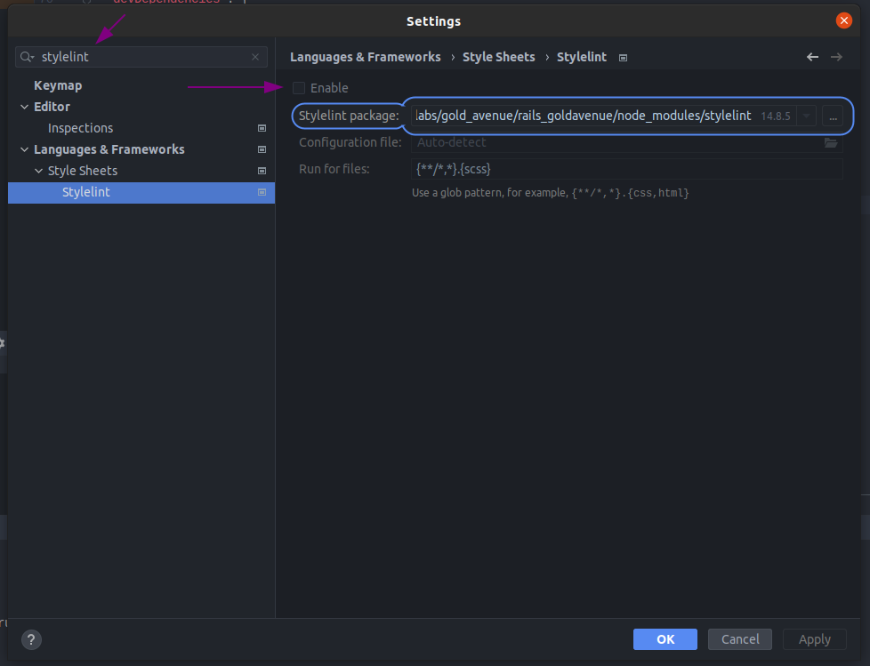
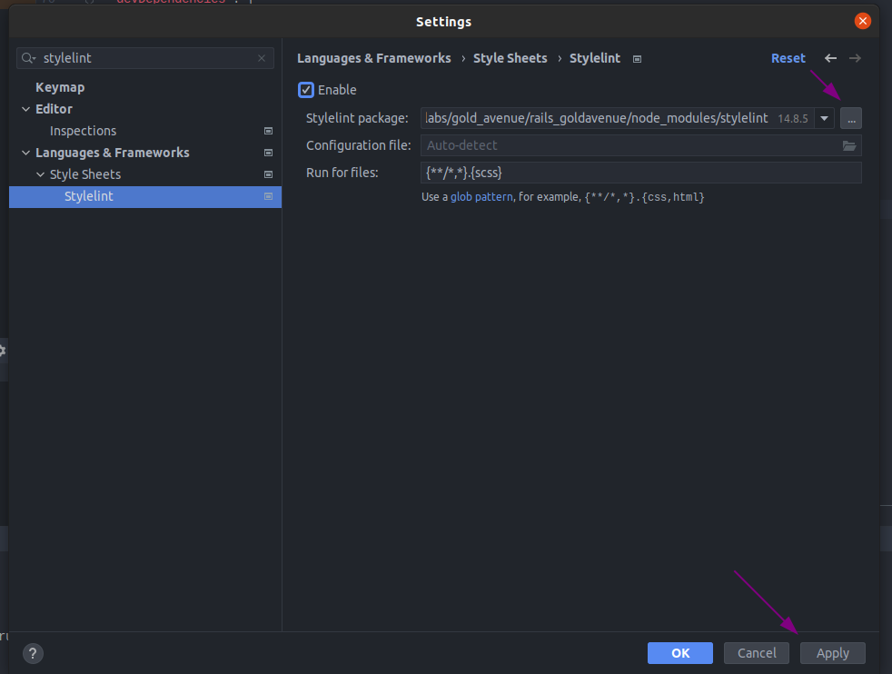
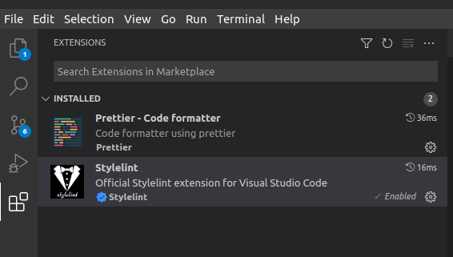
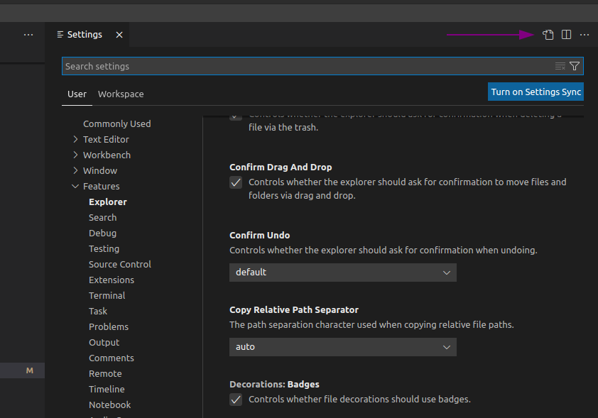

# Everlabs stylelint config


## Installation


### 1. Stylelint
```
npm install stylelint --save-dev
```


### 2. CSS and SCSS stylelint configs
```
npm install stylelint-config-standard-scss stylelint-config-recommended-scss --save-dev
```


### 3. Stylelint order
```
npm install stylelint-order stylelint-config-rational-order --save-dev
```


### 4. Copy file ``.sylelintrc.yml`` and paste it to the root folder of the project


### 5. Now need enable linter in the IDE


#### For JetBrains (Webstorm, Rubymine)
Open **File/settings**. In search input type **stylelint**. Then check **Enable**:



Click on 3 dots and select``node-modules/stylelint``. Than click on **Apply** and **OK**:



Now linter should working.


#### For Visual Code
First need to install plugins **Prettier** and **Stylelint**:



Open **file/preferences/settings**. Then turn on the JSON mode for the settings (as on screen below)



Now need to add (don't replace) to the ``settings.json`` next rules:
```json
{
  "stylelint.enable": true,
  "stylelint.validate": [
    "css",
    "scss"
  ],
  "css.validate": false,
  "scss.validate": false,
  "[scss]": {
    "editor.defaultFormatter": "esbenp.prettier-vscode"
  }
}
```
Don't forget to save file and then linter should works.


### 6. Add script to ``package.json``

```json
{
  "scripts": {
    "lint-css": "npx stylelint '[YOUR_PATH]/**/*.scss' --fix"
  }
}
```

Replace ``[YOUR_PATH]`` to path from your root folder of the project to folder where you store styles. If you don't need autofix, delete ``--fix``.


## Customisation


You can extend ``.stylelintrc.yml`` file by adding other rules. For example your project has SCSS files that should not be linted. You can add this files to the list;

```yaml
ignoreFiles: [
  # Exclude all min.scss files
  "**/*.min.scss",

  # Exclude vendors
  "**/vendors/**/*.scss",
  
  # Your files
  "**/example_file.scss"
]
```

Also you can disable or enable some rules that doesn't fit to your project:

```yaml
rules:
  color-named: null
  # other rules...
```

The list of rules:
- [CSS](https://stylelint.io/user-guide/rules/list)
- [SCSS](https://github.com/stylelint-scss/stylelint-scss#list-of-rules)
- [Rules order](https://github.com/hudochenkov/stylelint-order)
- [Example config with order rules](https://github.com/maxdenaro/maxgraph-youtube-source/blob/master/stylelint/.stylelintrc)


## Extends


Everlabs config extends:
- [stylelint-config-standard-scss](https://github.com/stylelint-scss/stylelint-config-standard-scss)
- [stylelint-config-rational-order](https://github.com/constverum/stylelint-config-rational-order)

The ``stylelint-config-standard-scss`` in turn under hood extend others:
- [stylelint-config-recommended](https://stylelint.io/user-guide/rules/list/#avoid-errors)
- [stylelint-config-standard](https://github.com/stylelint/stylelint-config-standard/blob/main/index.js)
- [stylelint-config-recommended-scss](https://github.com/stylelint-scss/stylelint-config-recommended-scss)

